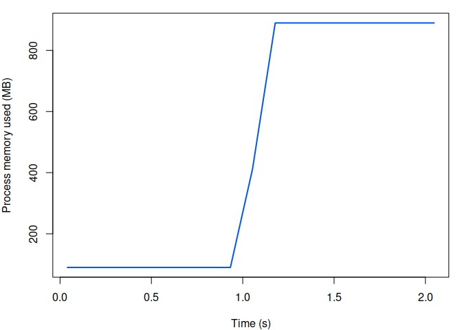

<!-- README.md is generated from README.Rmd. Please edit that file -->

# memprof

<!-- badges: start -->


<!-- badges: end -->

Evaluate an R expression whilst monitoring the process or your system
memory over time.

## Installation

You can install the development version of memprof from
[GitHub](https://github.com/) with:

``` r
# install.packages("remotes")
remotes::install_github("mrc-ide/memprof")
```

## Example

To monitor process memory including any spawned child processes:

``` r
library(memprof)

f <- function(msg) {
  Sys.sleep(1)
  z <- numeric(1e8) ## 800MB
  Sys.sleep(1)
  msg
}

out <- with_monitor(f("hello"))
```

``` r
plot(out)
```



To monitor system memory:

``` r
out <- with_monitor(f("hello"), mode = "system")
```

``` r
plot(out)
```


